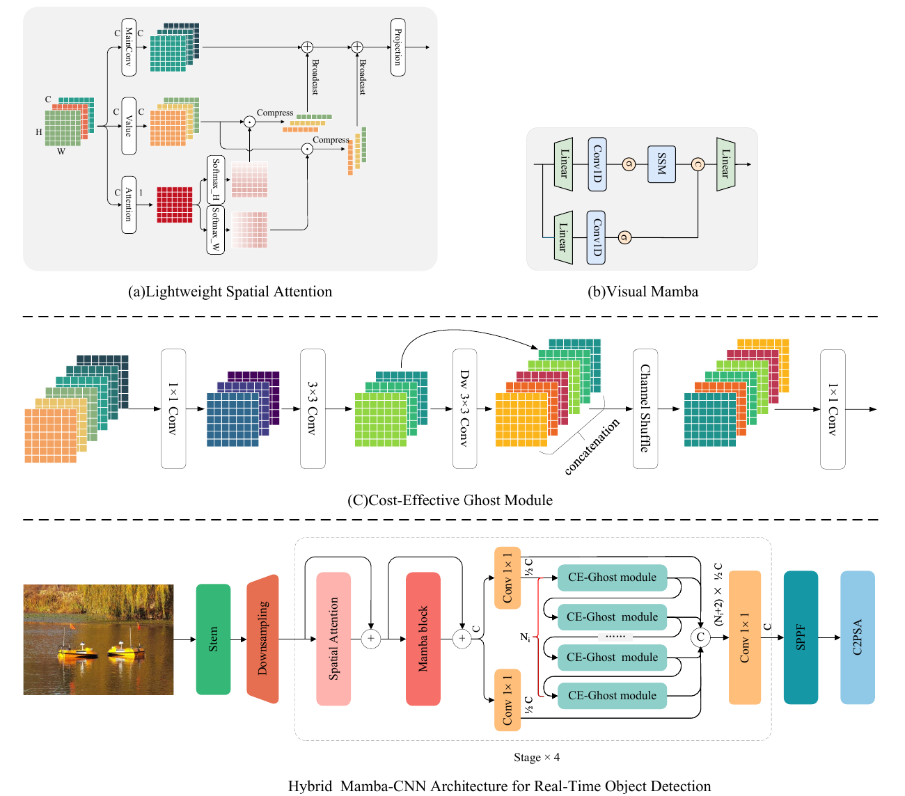

# A hybrid architecture based on structured state space sequence model and convolutional neural network for real-time object detection

## Introduction

Real-time performance is essential for practical deployment of object detection on edge devices, where high processing speed and low latency are paramount. This paper introduces a novel approach aimed at boosting real-time object detection while strictly adhering to computational constraints. A structured state space sequence model, Mamba, is strategically embedded in the early stages of the backbone network to capture long-range dependencies, thereby enhancing the model's representation capability. Given the limitations of Mamba in directional perception, a lightweight spatial attention mechanism is introduced to integrate global context into each spatial location. Additionally, a computationally efficient module inspired by the Ghost module is developed to reduce resource demands. This dual-strategy approach optimizes both performance and efficiency in real-time object detection. Extensive experiments demonstrate the superiority of this proposed approach; on the Microsoft Common Objects in Context (COCO) dataset, it achieves a +1.6 AP (Average Precision) improvement over state-of-the-art methods, reaching 41.1 AP with minimal added model complexity on the nano scale. The effectiveness and efficiency of each component are further substantiated through ablation studies on the Pascal Visual Object Classes (Pascal VOC dataset). To verify the universality of the proposed method, this study selects underwater detection, characterized by an extremely complex background environment, as the other validation scenario. Through the application of this proposed approach to underwater object detection, a state-of-the-art result of 69.5 AP was obtained on the Detecting Underwater Objects (DUO) dataset, exceeding that of You Only Look Once Detector version 11 (YOLO11) by +0.3 AP.



## Usage

Our detection code is developed on top of [MMYOLO v0.60](https://github.com/open-mmlab/mmyolo). Please prepare the environment according to the [installation](https://mmyolo.readthedocs.io/zh-cn/dev/get_started/installation.html) documentation.

**Note:** MMYOLO v0.60 supports up to PyTorch 1.13 and CUDA 11.7. Ensure that your environment meets these requirements for compatibility.

```bash
conda install pytorch==1.13.1 torchvision==0.14.1 torchaudio==0.13.1 pytorch-cuda=11.7 -c pytorch -c nvidia
```

### Training

- Multi-gpu training

```bash
bash dist_train.sh configs/hybrid/hybrid_s_syncbn_fast_8xb16-500e_coco.py 2
```

- Single-gpu Training

```bash
python train.py configs/hybrid/hybrid_s_syncbn_fast_8xb16-500e_coco.py
```

### Testing

```bash
python test.py configs/hybrid/hybrid_s_syncbn_fast_8xb16-500e_coco.py work_dirs/hybrid_s_syncbn_fast_8xb16-500e_coco/best_coco_bbox_mAP_epoch_xxx.pth
```

## Citation

If you find this project useful in your research, please consider cite:

```

```
